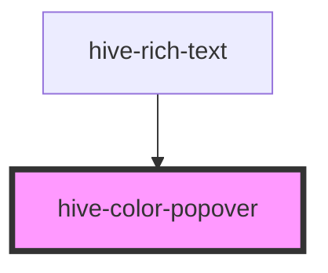

# hive-color-popover

<!-- Auto Generated Below -->

## Properties

| Property   | Attribute  | Description | Type                | Default     |
| ---------- | ---------- | ----------- | ------------------- | ----------- |
| `colors`   | --         |             | `string[]`          | `undefined` |
| `isOpen`   | `is-open`  |             | `boolean`           | `undefined` |
| `position` | `position` |             | `"bottom" \| "top"` | `undefined` |

## Events

| Event           | Description | Type               |
| --------------- | ----------- | ------------------ |
| `colorSelected` |             | `CustomEvent<any>` |

## Dependencies

### Used by

 - [hive-rich-text](../rich-text)

### Graph

----------------------------------------------

*Built with [StencilJS](https://stenciljs.com/)*
