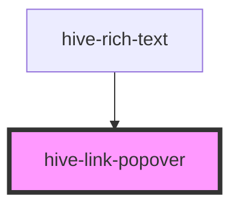

# hive-link-popover

<!-- Auto Generated Below -->

## Properties

| Property   | Attribute  | Description | Type      | Default     |
| ---------- | ---------- | ----------- | --------- | ----------- |
| `creating` | `creating` |             | `boolean` | `undefined` |
| `text`     | `text`     |             | `string`  | `undefined` |
| `url`      | `url`      |             | `string`  | `undefined` |

## Events

| Event    | Description | Type               |
| -------- | ----------- | ------------------ |
| `action` |             | `CustomEvent<any>` |

## Dependencies

### Used by

 - [hive-rich-text](../rich-text)

### Graph

----------------------------------------------

*Built with [StencilJS](https://stenciljs.com/)*
