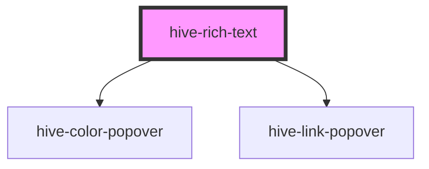

# hive-rich-text

<!-- Auto Generated Below -->

## Properties

| Property        | Attribute        | Description | Type                                                                                                                                                                                                                                                                                                         | Default                                         |
| --------------- | ---------------- | ----------- | ------------------------------------------------------------------------------------------------------------------------------------------------------------------------------------------------------------------------------------------------------------------------------------------------------------ | ----------------------------------------------- |
| `fontSmoothing` | `font-smoothing` |             | `boolean`                                                                                                                                                                                                                                                                                                    | `true`                                          |
| `options`       | --               |             | `{ toolbar?: string[]; colors?: string[]; highlights?: string[]; position?: "top" \| "bottom"; content?: string; placeholder?: string; showToolbar?: "always" \| "onHover" \| "onSelect"; autoFocus?: boolean; font?: { family?: string; url?: string; format?: string; size?: string; color?: string; }; }` | `{         placeholder: 'Insert text...'     }` |

## Events

| Event         | Description                                                                  | Type               |
| ------------- | ---------------------------------------------------------------------------- | ------------------ |
| `styleChange` | The style change event when the user clicks to apply a new style             | `CustomEvent<any>` |
| `textChange`  | The text change event when the user releases a key-up event in the text area | `CustomEvent<any>` |

## Methods

### `getContent() => Promise<{ text: string; html: string; }>`

#### Returns

Type: `Promise<{ text: string; html: string; }>`

### `setContent(value: string) => Promise<void>`

#### Returns

Type: `Promise<void>`

## Dependencies

### Depends on

- [hive-color-popover](../color-popover)
- [hive-link-popover](../link-popover)

### Graph

----------------------------------------------

*Built with [StencilJS](https://stenciljs.com/)*
