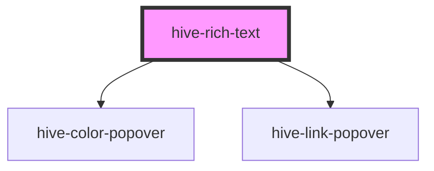

# hive-rich-text

<!-- Auto Generated Below -->

## Properties

| Property        | Attribute        | Description | Type                    | Default                                         |
| --------------- | ---------------- | ----------- | ----------------------- | ----------------------------------------------- |
| `fontSmoothing` | `font-smoothing` |             | `boolean`               | `true`                                          |
| `options`       | --               |             | `RichTextEditorOptions` | `{         placeholder: 'Insert text...'     }` |

## Events

| Event         | Description                                                                  | Type                |
| ------------- | ---------------------------------------------------------------------------- | ------------------- |
| `rteBlur`     |                                                                              | `CustomEvent<void>` |
| `rteFocus`    |                                                                              | `CustomEvent<void>` |
| `styleChange` | The style change event when the user clicks to apply a new style             | `CustomEvent<any>`  |
| `textChange`  | The text change event when the user releases a key-up event in the text area | `CustomEvent<any>`  |

## Methods

### `getContent() => Promise<{ text: string; html: string; }>`

#### Returns

Type: `Promise<{ text: string; html: string; }>`

### `hiveFocus() => Promise<void>`

#### Returns

Type: `Promise<void>`

### `setContent(value: string) => Promise<void>`

#### Returns

Type: `Promise<void>`

## Dependencies

### Depends on

- [hive-color-popover](../color-popover)
- [hive-link-popover](../link-popover)

### Graph

----------------------------------------------

*Built with [StencilJS](https://stenciljs.com/)*
